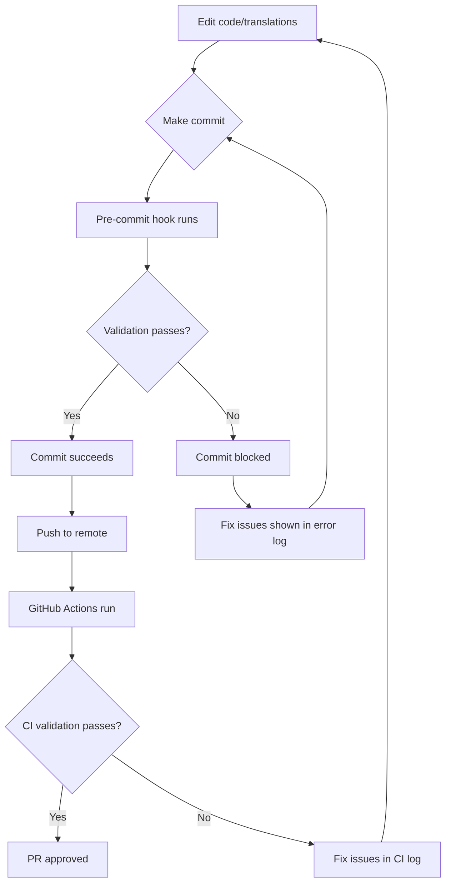

# Translation Automation System

> **Purpose:** Automated validation and quality assurance for all translation files and internationalization code across MathCalc Pro's 5 locales (cs, en, sk, pl, hu).

## Overview

The translation automation system prevents regressions and ensures translation quality through:

1. **Pre-commit hooks** - Validates translations before code is committed
2. **CI/CD pipeline** - Automated checks on pull requests and main branch
3. **Validation script** - Comprehensive checks for common translation issues
4. **ESLint rules** - Linting to catch hardcoded strings

---

## Quick Start

### Run Validation Locally

```bash
# Full validation (all checks)
npm run validate:translations

# Quick validation (syntax and key parity only)
npm run validate:translations:quick
```

### Test Pre-commit Hook

```bash
# Make a change to any translation file
echo '{"test": "value"}' >> src/messages/cs.json

# Try to commit
git add src/messages/cs.json
git commit -m "Test commit"

# Hook will run validation automatically
```

---

## System Components

### 1. Validation Script (`scripts/validate-translations.js`)

Comprehensive validation with 4 phases:

#### Phase 1: JSON Syntax Validation
- Ensures all locale files are valid JSON
- Catches syntax errors before they break builds
- **Example output:**
  ```
  ✓ cs.json - Valid JSON
  ✓ en.json - Valid JSON
  ✗ sk.json - Unexpected token } at position 1234
  ```

#### Phase 2: Key Parity Validation
- Compares all locale files against `cs.json` (reference)
- Reports missing keys per locale
- Calculates coverage percentage
- **Example output:**
  ```
  ✓ en.json - Complete (100% coverage)
  ⚠ sk.json - 42 missing keys (97.3% coverage)
      - bmi_alias_full
      - bmr_category_active
      ...
  ```

#### Phase 3: Hardcoded String Detection
- Scans all `.tsx` files in components and app directories
- Detects Czech diacritics in hardcoded strings
- Patterns detected:
  - `placeholder="Vyberte pohlaví"` → Should use `t('key')`
  - `<SelectValue placeholder="Czech text" />` → Should use `t('key')`
  - `<SelectItem>Czech text</SelectItem>` → Should use `t('key')`
  - `label="Czech text"` → Should use `t('key')`
- **Example output:**
  ```
  ⚠ components/calculators/CaloriesCalculator.tsx:266
      <SelectValue placeholder="Vyberte pohlaví" />
  ```

#### Phase 4: Interpolation Variable Validation
- Ensures interpolation variables match between locales
- Example: `{result}`, `{value}`, `{name}`
- **Example output:**
  ```
  ⚠ sk.json - "mortgage_result"
      Expected: {amount}, {rate}
      Found: {amount}
  ```

### 2. Pre-commit Hook (`.husky/pre-commit`)

Automatically runs `npm run validate:translations` before every commit.

**Behavior:**
- ✅ If validation passes → Commit proceeds
- ❌ If validation fails → Commit is blocked, error details shown

**Bypass (emergency only):**
```bash
git commit --no-verify -m "Emergency commit"
```

⚠️ **Warning:** Only bypass in emergencies. Fix issues properly instead.

### 3. GitHub Actions Workflow (`.github/workflows/translation-validation.yml`)

Two jobs run on PR and push to main/develop:

#### Job 1: Validate Translations
- Runs on every PR and push
- Executes `npm run validate:translations`
- Comments on PR if validation fails
- **Triggers:**
  - Changes to `src/messages/**`
  - Changes to `src/components/**`
  - Changes to `src/app/**`

#### Job 2: Translation Coverage Report
- Runs only on pull requests
- Generates coverage table for all 5 locales
- Posts comment to PR with coverage percentages
- **Example comment:**
  ```markdown
  ## Translation Coverage Report

  | Locale | Keys | Coverage | Status |
  |--------|------|----------|--------|
  | cs | 2147 | 100.0% | ✅ |
  | en | 2145 | 99.9% | ✅ |
  | sk | 2003 | 93.3% | ⚠️ |
  | pl | 2006 | 93.4% | ⚠️ |
  | hu | 2051 | 95.5% | ⚠️ |

  **Total reference keys:** 2147
  ```

### 4. ESLint Configuration (`.eslintrc.json`)

Basic ESLint setup for code quality:

- `no-console` - Warns on console usage (allow warn/error)
- `prefer-const` - Enforces const for non-reassigned variables
- `@typescript-eslint/no-explicit-any` - Warns on `any` type usage
- `@typescript-eslint/no-unused-vars` - Warns on unused variables

**Note:** Custom hardcoded string rule planned for future (requires custom ESLint plugin).

---

## Validation Rules

### ✅ What Passes Validation

```tsx
// ✅ Using translations
const t = useTranslations();
<input placeholder={t('input_placeholder')} />
<SelectValue placeholder={t('select_placeholder')} />
<SelectItem>{t('item_label')}</SelectItem>
```

```json
// ✅ All locales have same keys
// cs.json
{
  "bmi_title": "Kalkulačka BMI"
}

// en.json
{
  "bmi_title": "BMI Calculator"
}
```

```json
// ✅ Interpolation variables match
// cs.json
{
  "result_message": "Výsledek: {value} {unit}"
}

// en.json
{
  "result_message": "Result: {value} {unit}"
}
```

### ❌ What Fails Validation

```tsx
// ❌ Hardcoded Czech strings
<input placeholder="Zadejte hodnotu" />
<SelectValue placeholder="Vyberte možnost" />
<SelectItem>Možnost 1</SelectItem>
```

```json
// ❌ Missing keys
// cs.json has 2147 keys
// sk.json has 2003 keys → FAIL (missing 144 keys)
```

```json
// ❌ Interpolation mismatch
// cs.json
{
  "result": "Výsledek: {value} {unit}"
}

// en.json
{
  "result": "Result: {value}"  // Missing {unit}
}
```

```json
// ❌ Invalid JSON syntax
{
  "key": "value",  // Trailing comma
}
```

---

## Workflow Integration

### Developer Workflow



### PR Review Workflow

1. **Developer creates PR**
2. **GitHub Actions runs automatically:**
   - Validation job checks for errors
   - Coverage job posts comment with translation percentages
3. **Reviewer sees:**
   - ✅ Green check = all translations valid
   - ❌ Red X = validation failures (see logs)
   - 📊 Coverage comment shows completion status
4. **Merge decision:**
   - ✅ 100% coverage on en.json = **Required for merge**
   - ⚠️ <100% coverage on sk/pl/hu = **Acceptable** (warn reviewer)
   - ❌ Hardcoded text = **Block merge** (must fix)

---

## Maintenance

### Adding a New Calculator

When adding a new calculator, follow these steps to ensure translations pass:

1. **Add translation keys to cs.json and en.json:**
   ```json
   {
     "my_calc_title": "Moje kalkulačka",
     "my_calc_description": "Popis kalkulačky",
     "my_calc_input_label": "Zadejte hodnotu"
   }
   ```

2. **Use translations in component:**
   ```tsx
   const t = useTranslations();
   return (
     <SimpleCalculatorLayout
       title={t('my_calc_title')}
       description={t('my_calc_description')}
     >
       <CalculatorInput label={t('my_calc_input_label')} />
     </SimpleCalculatorLayout>
   );
   ```

3. **Run validation locally:**
   ```bash
   npm run validate:translations
   ```

4. **Fix any errors before commit:**
   - Missing keys in en.json
   - Hardcoded strings in component

5. **Commit and push:**
   ```bash
   git add .
   git commit -m "feat: Add new calculator with translations"
   # Pre-commit hook will validate automatically
   ```

### Updating Existing Translations

When updating translation keys or values:

1. **Update cs.json (reference)** first
2. **Update en.json** to match
3. **Optionally update sk/pl/hu** (or use translation-orchestrator agent)
4. **Run validation:**
   ```bash
   npm run validate:translations
   ```
5. **Commit changes**

### Fixing Hardcoded Text

When validation detects hardcoded Czech strings:

1. **Check validation output for file:line:**
   ```
   ⚠ components/calculators/CaloriesCalculator.tsx:266
       <SelectValue placeholder="Vyberte pohlaví" />
   ```

2. **Add translation key to cs.json and en.json:**
   ```json
   {
     "calories_gender_placeholder": "Vyberte pohlaví"
   }
   ```

3. **Update component to use translation:**
   ```tsx
   const t = useTranslations();
   <SelectValue placeholder={t('calories_gender_placeholder')} />
   ```

4. **Re-run validation:**
   ```bash
   npm run validate:translations
   ```

5. **Commit fix**

### Syncing Locale Files

To sync sk/pl/hu with cs.json (reference):

**Option 1: Use Translation Orchestrator Agent**
```
User: "Sync all locales with cs.json"
```

**Option 2: Manual process**
1. Run validation to see missing keys:
   ```bash
   npm run validate:translations
   ```

2. Copy output showing missing keys for each locale

3. Translate keys manually or use Claude to generate:
   ```
   User: "Add these 42 missing keys to sk.json with Slovak translations: [paste keys]"
   ```

4. Validate again to ensure 100% coverage

---

## Troubleshooting

### Pre-commit Hook Not Running

**Symptom:** Commits succeed even with invalid translations.

**Solution:**
```bash
# Reinstall Husky
rm -rf .husky
npm run prepare
npx husky add .husky/pre-commit "npm run validate:translations"
```

### GitHub Actions Failing

**Symptom:** CI fails with "Module not found" or similar.

**Solution:**
1. Check that `package.json` includes all dependencies
2. Ensure `npm ci` is used (not `npm install`)
3. Verify `chalk` dependency is listed (required by validation script)

### False Positives for Hardcoded Text

**Symptom:** Validation reports hardcoded text that is actually correct code.

**Solution:**
- Check if the reported string contains Czech diacritics (`áčďéěíňóřšťúůýž`)
- If it's a false positive, consider:
  1. Refactoring the code to avoid the pattern
  2. Updating the regex pattern in `scripts/validate-translations.js`

**Example false positive:**
```tsx
// This might trigger false positive if variable name has diacritics
const měna = "USD"; // Variable name, not display text
```

**Fix:** Rename variable to English:
```tsx
const currency = "USD";
```

### Validation Passes Locally but Fails in CI

**Symptom:** `npm run validate:translations` works locally but fails in GitHub Actions.

**Possible causes:**
1. **Different Node versions** → Solution: Ensure local Node matches CI (v18)
2. **Missing files in git** → Solution: Check `.gitignore`, ensure all locale files are committed
3. **Line ending differences** → Solution: Configure `.gitattributes`:
   ```
   *.json text eol=lf
   ```

---

## Performance

### Validation Script Performance

| Phase | Time (avg) | Files scanned |
|-------|------------|---------------|
| JSON Syntax | 0.05s | 5 locale files |
| Key Parity | 0.1s | 5 locale files |
| Hardcoded Strings | 2-5s | ~100 .tsx files |
| Interpolation | 0.2s | 5 locale files |
| **Total** | **2-6s** | **~105 files** |

### Pre-commit Hook Impact

- **Average runtime:** 2-6 seconds
- **Impact on commit time:** Low (runs in background)
- **Developer experience:** Minimal friction

### CI/CD Impact

- **Validation job:** ~30-45 seconds (with npm install)
- **Coverage report job:** ~25-35 seconds
- **Total CI time:** ~1 minute (runs in parallel)

---

## Metrics and Monitoring

### Current Translation Status

As of **2026-02-15** (auto-updated by CI):

| Locale | Keys | Coverage | Missing | Status |
|--------|------|----------|---------|--------|
| cs.json | 2147 | 100% | 0 (reference) | ✅ |
| en.json | 2145 | 99.9% | 2 | ✅ |
| sk.json | 2003 | 93.3% | 144 | ⚠️ |
| pl.json | 2006 | 93.4% | 141 | ⚠️ |
| hu.json | 2051 | 95.5% | 96 | ⚠️ |

**Hardcoded text instances:** 27+ (as of audit 2026-02-15)

### Goals

- ✅ **cs.json:** 100% coverage (reference)
- ✅ **en.json:** 100% coverage (REQUIRED before production)
- 🎯 **sk/pl/hu.json:** 100% coverage (TARGET)
- 🎯 **Hardcoded text:** 0 instances (TARGET)

### Tracking Progress

Run this command to see current status:
```bash
npm run validate:translations
```

Check GitHub Actions for historical trends:
- Go to **Actions** tab
- Select **Translation Validation** workflow
- Review recent runs for coverage trends

---

## Future Enhancements

### Planned Features

1. **Custom ESLint Plugin for Hardcoded Strings**
   - Real-time detection in IDE
   - Auto-fix suggestions
   - Integration with VS Code

2. **Translation Coverage Badge**
   - Display coverage % in README.md
   - Auto-update via GitHub Actions
   - Link to coverage report

3. **Automated Translation Suggestions**
   - AI-powered translation generation for missing keys
   - Integration with translation-orchestrator agent
   - Automatic PR creation for missing translations

4. **Visual Diff for Translation Changes**
   - Show before/after for translation updates
   - Highlight impacted calculators
   - Reviewer-friendly visualization

5. **Translation Usage Analytics**
   - Track unused translation keys
   - Suggest cleanup of stale keys
   - Report on most frequently used keys

---

## Related Documentation

- **Translation Orchestrator Agent:** [`translation-orchestrator-agent.md`](translation-orchestrator-agent.md)
- **Translation Usage Guide:** [`translation-orchestrator-usage.md`](translation-orchestrator-usage.md)
- **Quick Start Guide:** [`translation-orchestrator-quickstart.md`](translation-orchestrator-quickstart.md)
- **Audit Reports:**
  - [`../TRANSLATION_AUDIT_2026-02-15.md`](../TRANSLATION_AUDIT_2026-02-15.md)
  - [`../HARDCODED_TEXT_INVENTORY.csv`](../HARDCODED_TEXT_INVENTORY.csv)
  - [`../MISSING_KEYS_BY_LOCALE.txt`](../MISSING_KEYS_BY_LOCALE.txt)

---

## Support

**Questions or issues?**
- Check validation script output for detailed error messages
- Review GitHub Actions logs for CI failures
- Use translation-orchestrator agent for bulk translation work
- Consult `CLAUDE.md` section 12 for translation workflows

---

*This automation system ensures translation quality scales to 141+ calculators across 5 locales without manual overhead.*
